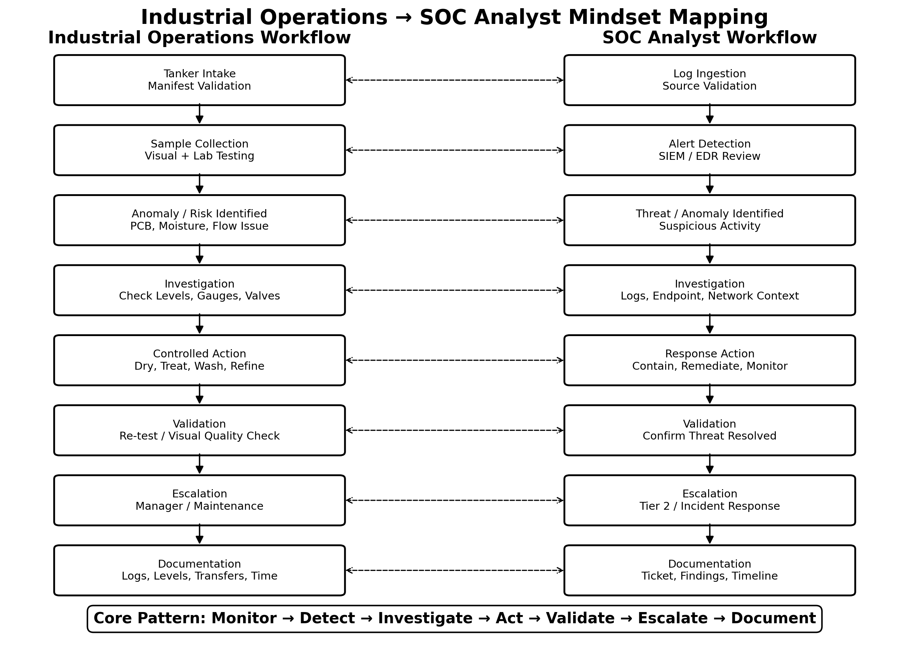

# Industrial Operations to SOC Analyst Mindset

## Project Overview

This project demonstrates how my current role as a Tank Farm Technician in an oil processing plant directly translates to the responsibilities and mindset of a SOC Analyst Level 1.

Although my professional experience is not in cybersecurity, my daily responsibilities require continuous monitoring, anomaly detection, structured investigation, real-time decision-making, escalation, and detailed documentation.

The purpose of this project is to show how my operational experience has prepared me for SOC analyst work by mapping my current responsibilities to equivalent security operations workflows.
